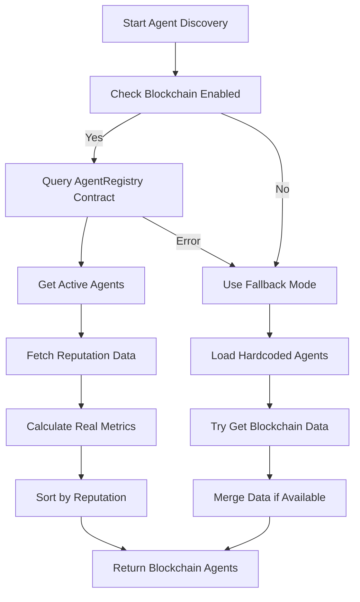

# Blockchain Integration: Flow EVM Testnet

## Overview

The orchestrator now integrates with deployed smart contracts on **Flow EVM Testnet** for reputation and cost management instead of using hardcoded values. This provides a decentralized, transparent, and accurate source of truth for agent costs and performance metrics.

## Deployed Contracts on Flow EVM Testnet

| Contract                  | Address                                      | Purpose                                            |
| ------------------------- | -------------------------------------------- | -------------------------------------------------- |
| **AgentRegistry**         | `0x0dcCe2649be92E4457d9d381D8173f3fD7FcAA68` | Agent registration, discovery, and cost management |
| **ReputationLayer**       | `0xDE36662dD44343a65a60FB6c1927A2FCB042936e` | Agent reputation tracking and performance metrics  |
| **OrchestrationContract** | `0xBE0caD36B87c428a2d67e73f6738B321A86547df` | Task creation and execution management             |

### Network Details

- **Network**: Flow EVM Testnet
- **Chain ID**: 545
- **RPC URL**: `https://testnet.evm.nodes.onflow.org`
- **Block Explorer**: `https://evm-testnet.flowscan.io`
- **Currency**: FLOW tokens

## Key Changes: From Hardcoded to Blockchain

### ❌ Before: Hardcoded Values

```typescript
// Agents had hardcoded costs and reputation
const agent = {
  pricing: { amount: 0.1, currency: "ETH" }, // Hardcoded
  rating: { score: 4.5, reviews: 10 }, // Hardcoded
  performance: { successRate: 85 }, // Hardcoded
};
```

### ✅ After: Blockchain-Sourced Data

```typescript
// Agent data comes from Flow EVM Testnet contracts
const cost = await blockchainService.getAgentCost(agentUrl); // From AgentRegistry
const reputation = await blockchainService.getReputationData(addr); // From ReputationLayer
const performance = calculateFromReputation(reputation); // Real metrics
```

## Configuration Changes

### 1. Updated `config.ts`

```typescript
// Flow EVM Testnet Configuration
export const FLOW_EVM_CONFIG = {
  NETWORK_NAME: "Flow EVM Testnet",
  CHAIN_ID: 545,
  RPC_URL: "https://testnet.evm.nodes.onflow.org",
  CONTRACTS: {
    AgentRegistry: "0x0dcCe2649be92E4457d9d381D8173f3fD7FcAA68",
    ReputationLayer: "0xDE36662dD44343a65a60FB6c1927A2FCB042936e",
    OrchestrationContract: "0xBE0caD36B87c428a2d67e73f6738B321A86547df",
  },
};

// Blockchain-first configuration
export const config = {
  BLOCKCHAIN: {
    ENABLED: true,
    RPC_URL: FLOW_EVM_CONFIG.RPC_URL,
    CONTRACTS: FLOW_EVM_CONFIG.CONTRACTS,
    PRIVATE_KEY: process.env.MY_METAMASK_PRIVATE_KEY_WITH_FLOW_TESTNET,
  },

  // Agent discovery from blockchain first, fallback to hardcoded
  AGENT_DISCOVERY: {
    SOURCE: "blockchain", // "blockchain" | "hardcoded"
    FALLBACK_AGENTS: AGENTS,
    REFRESH_INTERVAL: 300000, // 5 minutes
  },

  // Use blockchain contracts for reputation and costs
  REPUTATION_SOURCE: "blockchain", // "blockchain" | "local"
  COST_SOURCE: "blockchain", // "blockchain" | "agent"
};
```

### 2. Enhanced `BlockchainService.ts`

- **Real contract addresses**: Uses deployed Flow EVM Testnet contracts
- **Gas optimization**: Proper gas price (2 gwei) for Flow EVM
- **Cost queries**: `getAgentCost()` retrieves real agent costs
- **Reputation tracking**: `getReputationData()` gets real performance metrics
- **Task recording**: `recordTaskCompletion()` updates reputation on-chain

### 3. Updated `JobRunner.ts`

- **Blockchain-first discovery**: Prioritizes agents from blockchain registry
- **Cost integration**: Shows real agent costs during execution
- **Reputation tracking**: Records task success/failure on blockchain
- **Fallback support**: Falls back to hardcoded agents if blockchain unavailable

## Agent Discovery Flow



## Cost Management

### Before

- Agents self-reported costs
- No verification or consistency
- Different currencies (ETH, USD, etc.)

### After

- All costs stored on blockchain in FLOW tokens
- Transparent and immutable pricing
- Real-time cost queries during task execution

```typescript
// Real cost query from blockchain
const cost = await jobRunner.getAgentCost("http://localhost:3001");
// Returns: { amount: 0.1, currency: "FLOW" }
```

## Reputation System

### Before

- Static ratings and reviews
- No real performance tracking
- No fraud protection

### After

- Dynamic reputation based on actual task performance
- Success rate, latency, and reliability tracking
- Automatic updates after each task execution

```typescript
// Real reputation from blockchain
const reputation = await blockchainService.getReputationData(agentAddress);
// Returns: {
//   totalTasks: 150,
//   successfulTasks: 142,
//   averageLatency: 2500, // ms
//   reputationScore: 945   // 0-1000 scale
// }
```

## Environment Setup

### Required Environment Variables

```bash
# .env file in orchestrator directory
MY_METAMASK_PRIVATE_KEY_WITH_FLOW_TESTNET=0x6f7e069588791fd3ee05194c69fbcad815fa49625bd5a3832945e4019790012b
```

### Validation

The system validates blockchain configuration on startup:

```typescript
const isValid = validateBlockchainConfig();
// Checks:
// ✓ Private key configured
// ✓ RPC URL accessible
// ✓ Contract addresses valid
// ✓ Network connectivity
```

## Benefits

### 🔒 **Transparency**

- All agent costs and reputation data on public blockchain
- Immutable performance history
- No manipulation or fake ratings

### 💰 **Accurate Costs**

- Real-time pricing from contracts
- Consistent currency (FLOW tokens)
- No hidden fees or outdated prices

### 📊 **Real Reputation**

- Performance based on actual task execution
- Automatic updates after each job
- Prevents reputation gaming

### 🔄 **Decentralization**

- No central authority controlling agent data
- Agents register themselves on blockchain
- Community-driven quality metrics

## Monitoring

### Agent Discovery Logs

```
🔍 Discovering agents from Flow EVM Testnet registry...
📊 Found 7 agents in blockchain registry
✅ Loaded blockchain agent: Hello World Agent (0.1 FLOW/task)
✅ Loaded blockchain agent: Image Generator (0.5 FLOW/task)
🎯 Total agents discovered: 7 (blockchain-first discovery on Flow EVM Testnet)
```

### Task Execution Logs

```
💰 Executing task on http://localhost:3001 (Cost: 0.1 FLOW)
📊 Recording task completion on Flow EVM Testnet: 0x1234... (success)
✅ Task completion recorded on Flow EVM Testnet: https://evm-testnet.flowscan.io/tx/0xabc...
```

## Future Enhancements

1. **Agent Staking**: Require agents to stake FLOW tokens for registration
2. **Slashing**: Penalize agents for poor performance or malicious behavior
3. **Governance**: Community voting on agent parameters and policies
4. **Fee Distribution**: Share task fees between orchestrator and protocol
5. **Cross-Chain**: Support multiple blockchains for agent registration

## Troubleshooting

### Common Issues

1. **"Blockchain integration disabled"**

   - Check `MY_METAMASK_PRIVATE_KEY_WITH_FLOW_TESTNET` in `.env`
   - Verify private key has `0x` prefix

2. **"Agent not found in blockchain registry"**

   - Agent needs to be registered on-chain first
   - Check agent URL matches blockchain registration

3. **"Failed to record task completion"**
   - Wallet needs FLOW tokens for gas
   - RPC connection might be unstable

### Manual Contract Interaction

```bash
# Check agent cost
cast call 0x0dcCe2649be92E4457d9d381D8173f3fD7FcAA68 \
  "getAgentByUrl(string)" "http://localhost:3001" \
  --rpc-url https://testnet.evm.nodes.onflow.org

# Check reputation
cast call 0xDE36662dD44343a65a60FB6c1927A2FCB042936e \
  "getReputationData(address)" "0x1234..." \
  --rpc-url https://testnet.evm.nodes.onflow.org
```

---

🎉 **The orchestrator now uses Flow EVM Testnet smart contracts for all reputation and cost management, providing transparent, decentralized, and accurate agent metrics!**
